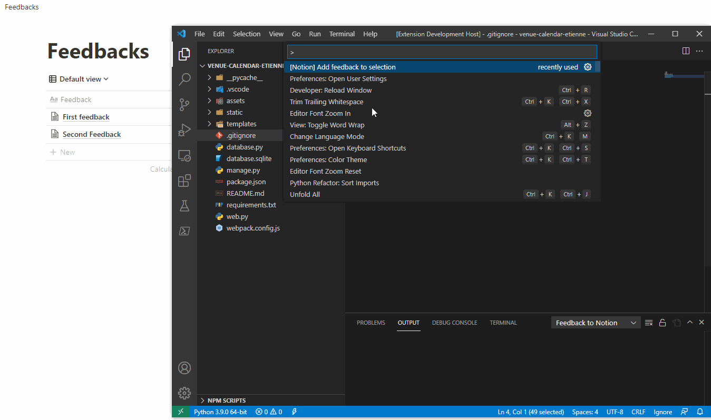
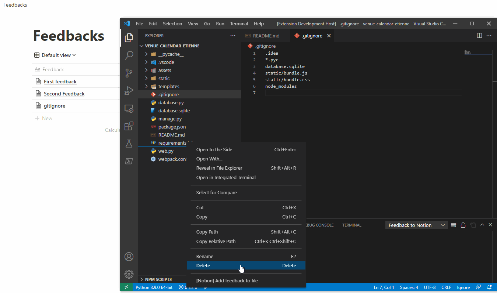

# Feedback To Notion

A simple vscode extension to send code feedbacks to a [Notion](https://www.notion.so/) database.

## Features
You can either create a new feedback or update an existing one.

You can send feedback on :
- a piece of code

- on a whole file

## Requirements
You need to create an [custom integration](https://www.notion.so/my-integrations) in Notion, [read the docs](https://www.notion.so/help/add-and-manage-integrations-with-the-api) on how to do that.

For now (07/01/2022), the fields in your feedback database should be the following : 
- Feedback (text)
- Tags (multi select)
- Creator (person)
- Contributors (person)
- Counter (number)

## Extension Settings

This extension contributes the following settings:  
`notion.token` : Token provided by notion when adding the extension to your workspace (ie. `secret_xxxxx`).

`notion.databaseId` : Your Feedback database ID. Database IDs can found in Notion urls : https://www.notion.so/<workspace_name>/<databse_id>.

`notion.myPersonId` :  Use your browser dev tools. Go to Notion > Click your name (top left) > My account. You should see a call to `getDataAccessConsent` with your user id in the response

## 1.0.0

Initial release
